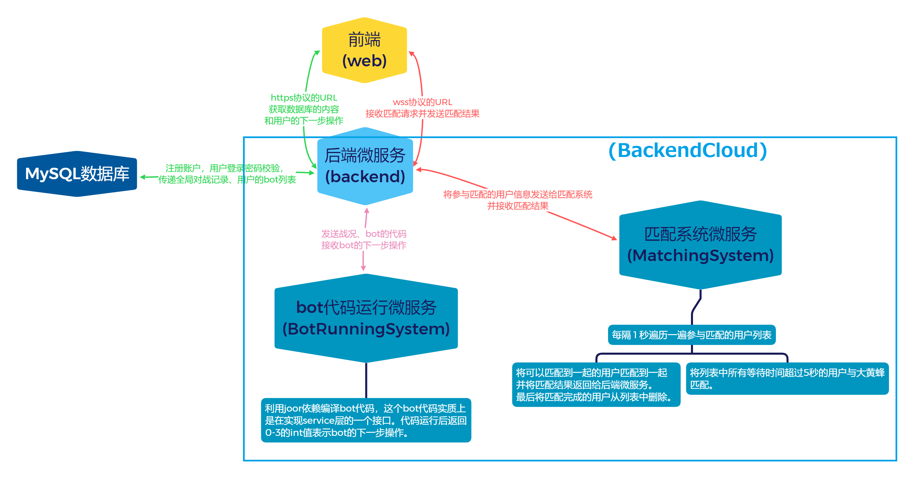

# 整个项目的通信结构

# 描述各个组件的工作
下面描述从 用户点击“开始匹配”到网页显示蛇的移动期间前后端各个组件的工作流程。

用户在网页端可以选择亲自出马或者自己的bot来参与对战。点击开始匹配后，参与匹配的用户id和botId传入后端微服务(backend)。后端微服务将这些匹配信息传给匹配系统(Matching System)。

匹配系统匹配成功后再将匹配结果传给后端微服务。后端微服务立即随机生成一张游戏地图并将匹配成功的信息以及游戏地图发送给前端。

如果用户使用bot参加游戏，后端微服务将bot代码以及战况发送给bot代码运行的微服务(Botrunning System)，并等待这段代码的返回值。如果用户亲自出马，后端微服务将等待用户的下一步输入，以操纵蛇的移动方向。

bot代码运行的微服务可能会接收到多个bot代码，它将这些对象存放在一个线程安全的list中。再

不论如何，后端将收到蛇的下一步移动方向，然后更新游戏地图以判断是否有玩家输掉了比赛，如果有则将结果返回给前端，如果没有则将两条蛇的下一步移动方向同时发送给前端。

前端收到消息后再根据情况渲染不同的前端组件(ResultBoard或GameMap)。

